# Neuromuscular Research Toolkit (NMRT)

[](https://github.com/vinayrshankar/Neuromuscular-Research-Toolkit/actions/workflows/ci.yml) [](LICENSE) [](https://www.python.org/)

**A device-agnostic research workbench for acquisition-aware import, QC, preprocessing, synchronization, analysis, batch processing, and reproducible reporting of neuromuscular data.**

**Author:** Vinay Shankar  
**Website:** https://tfaworld.org/  
**Email:** vinay@tfaworld.org  
**License:** MIT  
**Status:** v0.1.0 foundation

## Why this exists

Neuromuscular laboratories routinely combine EMG, force/torque, accelerometry, triggers, respiratory signals, audio, and behavioral events using hardware from different vendors. The scientific workflow is often split across acquisition software, MATLAB scripts, spreadsheets, one-off preprocessing code, and manual QC.

NMRT is designed to make the workflow explicit and reproducible:

**Import/acquire → map channels → validate → synchronize → preprocess → segment → analyze → compare → export → report.**

It is intentionally **study-agnostic** and **device-agnostic**. Study names, muscle names, trial structures, filter settings, analysis windows, expected channels, and QC rules belong in configuration files rather than hard-coded analysis scripts.

## Design principles

1. **Raw data are immutable.** Processing never silently overwrites source recordings.
2. **Every transformation is traceable.** Filter settings, normalization, windows, exclusions, and software versions are recorded.
3. **Channel identity is explicit.** Sampling rate alone never proves anatomical identity.
4. **Batch and interactive workflows use the same engine.** A GUI should call the same tested functions as the CLI/API.
5. **Hardware support is modular.** Delsys, NI, CED/Spike2, LabChart exports, and generic files are adapters, not separate applications.
6. **Research decisions stay with the researcher.** QC flags are inspectable; automatic exclusion is opt-in.
7. **Synthetic data are first-class.** Examples and tests never require participant data.
8. **No diagnostic claims.** NMRT is research software, not a medical device.

## Signal families

The architecture supports or is planned to support:

- surface EMG and high-density EMG
- force, torque, load-cell and dynamometer signals
- accelerometer, gyroscope and other IMU channels
- respiratory airflow, pressure and spirometry exports
- acoustic/voice/cough recordings
- digital/analog triggers and event markers
- kinematic, goniometer and position channels
- behavioral task events and response streams

## Current v0.1 capabilities

- Common recording/channel/event data model
- CSV/TSV and NPZ import/export
- Configurable channel mapping
- Signal-level QC: missing values, flatline, clipping proxy, robust outliers, duration
- EMG filtering, rectification, linear envelope, RMS, MAV and iEMG
- Force filtering, SD, CV, RMS, yank, normalized yank and approximate entropy
- Welch PSD and user-defined spectral-band power
- Magnitude-squared coherence between synchronized channels
- IMU vector magnitude
- Respiratory inspiration/expiration phase detection from flow
- Basic acoustic RMS/dB and autocorrelation F0 estimate
- Event/trial segmentation
- YAML recipe runner
- CSV + JSON result export
- Synthetic demonstration dataset
- Automated tests for core numerical behavior

## Architecture

```mermaid
flowchart LR
    A[Acquisition & Import Adapters] --> B[Canonical Recording]
    B --> C[Channel Map & Calibration]
    C --> D[QC]
    D --> E[Synchronization]
    E --> F[Preprocessing]
    F --> G[Events & Trial Segmentation]
    G --> H[Signal Analysis]
    H --> I[Cross-Signal Analysis]
    I --> J[Batch Results]
    J --> K[Reports / CSV / JSON / NWB]
```



The canonical model keeps signal data, sample rate, units, timing, channel metadata, events, provenance, and processing history together.

## Installation

```bash
python -m venv .venv
# Windows: .venv\Scripts\activate
# macOS/Linux: source .venv/bin/activate
pip install -e .
```

Developer installation:

```bash
pip install -e ".[dev]"
pytest
```

Optional import/export support:

```bash
pip install -e ".[all]"
```

## First run

Generate and analyze a synthetic force + EMG recording:

```bash
python examples/synthetic_force_emg.py
```

Run a configuration-driven pipeline:

```bash
nmrt run configs/example_force_emg.yaml
```

## Python example

```python
from nmrt.synthetic import make_force_emg_demo
from nmrt.processing.emg import emg_envelope, emg_features
from nmrt.processing.force import force_features

rec = make_force_emg_demo(duration_s=30, fs=1000)

emg = rec.signals["TA_EMG"]
force = rec.signals["Force"]

envelope = emg_envelope(emg.data, emg.fs)
print(emg_features(emg.data, emg.fs))
print(force_features(force.data, force.fs, mean_target=10.0))
```

## Planned hardware and file adapters

| Source | Direction | Strategy |
|---|---|---|
| Delsys EMGworks HPF | Import | Optional adapter using the user's licensed Delsys conversion library |
| Delsys CSV/exports | Import | Native generic parser + metadata mapping |
| National Instruments DAQ | Acquire | Optional NI adapter; MATLAB bridge and future Python backend |
| CED Spike2 `.smr/.smrx` | Import | Optional Neo-based adapter where supported |
| ADInstruments/LabChart exports | Import | CSV/MAT/text adapters first; native formats only where legally/technically supported |
| MATLAB `.mat` | Import/export | scipy/h5py adapter |
| C3D | Import | Optional ezc3d adapter |
| NWB | Import/export | Optional PyNWB adapter |
| CSV/TSV/NPZ | Import/export | Core |
| WAV | Import | Python standard/scipy audio path |

Proprietary vendor libraries and licensed components are **not** redistributed by NMRT.

## Scientific analysis roadmap

### EMG
Filtering, notch, rectification, RMS/MAV/iEMG, envelopes, onset/offset, MVC normalization, frequency-domain metrics, fatigue trends, co-contraction, burst analysis, activation variability, and later HD-sEMG/decomposition adapters.

### Force / torque / motor output
Mean, SD, CV, RMS, error, absolute error, yank, normalized yank, jerk, approximate/sample entropy, spectral power, target tracking, onset/offset, MVC normalization, time-to-task-failure, steadiness, consistency, and trial-to-trial variability.

### Spectral and coupling
Welch PSD, configurable bands, cross-spectral density, coherence, cross-correlation, lag analysis, time-frequency transforms, and future EMG-force/EMG-EMG coupling workflows.

### IMU / movement
Acceleration magnitude, axis-specific metrics, orientation-aware extensions, tremor bands, movement onset, movement variability, and task segmentation.

### Respiratory / acoustic motor output
Breathing phase detection, airflow features, cough timing/intensity descriptors, sustained-vowel and syllable timing/amplitude features, and export hooks to specialist speech packages.

### Study workflows
MVC, sustained submaximal contraction, force-control/visual-gain tasks, fatigue, discrete motor responses, reaction-time tasks, repeated syllables, sustained phonation, cough, spirometry, and arbitrary event-driven tasks.

## Reproducibility model

Each analysis recipe can specify:

- expected signals and units
- channel aliases
- file/folder filters
- sample-rate expectations
- calibration/scaling
- preprocessing steps
- event definitions
- analysis windows
- QC thresholds
- metrics
- output directory
- software/configuration version

The long-term goal is that a paper can archive the exact YAML recipe used to reproduce its signal-processing pipeline.

## Project structure

```text
src/nmrt/
  core/          canonical data model, provenance, QC
  io/            device/file adapters
  processing/    signal-family preprocessing and features
  analysis/      spectral, variability and cross-signal analyses
  acquisition/   live hardware adapters (optional)
  pipeline/      configuration-driven batch engine
  reporting/     machine-readable and human-readable reports
  gui/           future desktop workbench
examples/         synthetic, non-participant examples
configs/          reproducible analysis recipes
docs/             architecture, standards, hardware and validation guides
tests/            numerical and regression tests
```

## Documentation

- [Documentation index](docs/README.md)
- [Architecture](docs/ARCHITECTURE.md)
- [Validation framework](docs/VALIDATION.md)
- [Hardware and vendor adapters](docs/HARDWARE_ADAPTERS.md)
- [Ultimate roadmap](docs/ULTIMATE_ROADMAP.md)
- [Contributing](CONTRIBUTING.md)
- [Support](SUPPORT.md)
- [Security](SECURITY.md)

## Relationship to existing projects

NMRT does not try to replace mature general-purpose scientific libraries. It builds on NumPy/SciPy/Pandas and is designed to interoperate with ecosystems such as NWB, MNE, NeuroKit2, Pyomeca, Neo, and ezc3d where appropriate. The differentiator is the **end-to-end, device-aware neuromuscular research workflow**: channel mapping, QC, synchronized multimodal motor signals, reusable study recipes, provenance, and batch reporting.

## Validation philosophy

Every scientific metric should eventually have at least one of:

- an analytical test signal with a known answer;
- comparison against a trusted implementation;
- a published formula/reference;
- a frozen regression dataset generated from synthetic data.

Algorithms that have not completed validation should be marked **experimental** rather than silently presented as established.

## Data safety and research privacy

Do not commit identifiable participant data to a public repository. Synthetic datasets should be used for examples, documentation, unit tests, and CI. Researchers are responsible for following their IRB/ethics approval, consent language, institutional policy, and applicable privacy requirements.

## Citation

Use [`CITATION.cff`](CITATION.cff). DOI-based citation information can be added when a version is archived through a service such as Zenodo.

## License

MIT License. See [`LICENSE`](LICENSE).
